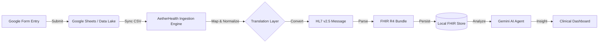

#  AetherHealth Enterprise Interoperability Layer

[](https://opensource.org/licenses/MIT)
[](http://hl7.org/fhir/)
[](https://deepmind.google/technologies/gemini/)

> **A robust bridge transforming unstructured field data into standardized AI-ready clinical intelligence.**

### [🚀 LAUNCH ENTERPRISE DASHBOARD](https://ai.studio/apps/drive/1KdM4XZO5ESKjnUoZHihNy-Ev0DpooiRU?fullscreenApplet=true)

---

## 🔗 Live Data Ingestion Channels
The application listens to the following active data streams. Submitting data via these Google Forms will automatically be ingested, converted to HL7/FHIR, and displayed in the app dashboard.

| Input Channel | Purpose | Google Form Link | Raw Data Lake (CSV) |
|:--- |:--- |:--- |:--- |
| **Channel A** | **Patient SOAP Notes & Triage** <br> *Primary intake form for new patients.* | [**👉 Open SOAP Form**](https://docs.google.com/forms/d/e/1FAIpQLSdST7Gm8bSD8rCs89AMzKrXhiww0SfTGZcXMgNpZyyue2cbQw/viewform) | [Download/View CSV](https://docs.google.com/spreadsheets/d/e/2PACX-1vRh7DqUADDoL6_ACzJLgA3z3UnV3IRDFrKJtHXUIQauVok2X1Gx_tInzsyOKdnvmdVgbiZGdtY-wvFX/pub?output=csv) |
| **Channel B** | **Vitals & Monitoring** <br> *Recurring updates for existing patients.* | [**👉 Open Vitals Form**](https://docs.google.com/forms/d/e/1FAIpQLSeTcuHPtPYJA1d4wfR8VINS_a2VThH7x1v3vh6dUj-yrY_P5A/viewform) | [Download/View CSV](https://docs.google.com/spreadsheets/d/e/2PACX-1vQW0aRj-dJIS_sqFGXvoLxiSLQw5PwpaQyUpvDyAFs2_g010u8ru8g39TM2irtecgR2pX_8yqPbmwkw/pub?output=csv) |

---

## 🏗️ System Architecture & Process Flow

### 1. The Interoperability Pipeline
The system uses a "Store & Forward" architecture to ingest messy field data and normalize it into FHIR.



### 2. Data Transformation Logic
AetherHealth translates "Human" questions into "Machine" codes.

```mermaid
classDiagram
    class GoogleSheetRow {
        +String "What is your fever?"
        +String "Heart Rate?"
        +String "Patient Name"
    }
    class FHIR_Observation {
        +CodeableConcept code (8310-5)
        +Quantity value
        +Reference subject
    }
    class Gemini_AI {
        +analyze(Bundle)
        +generateRiskScore()
    }
    
    GoogleSheetRow -->|Fuzzy Matching| FHIR_Observation
    FHIR_Observation -->|Context| Gemini_AI
```

---

## ⚡ Key Capabilities

### 1. Smart Ingestion Engine (Universal Adapter)
Real-world data is never perfect. Our engine:
- **Fuzzy Matches Headers:** It understands that "What is the patient's temp?" means `Body Temperature`.
- **Prevents Duplicates:** It intelligently merges new form responses into existing patient records using ID matching logic.
- **Simulates Legacy Tech:** It generates raw **HL7 v2.5 ADT messages** internally to demonstrate how legacy hospital systems communicate.

### 2. AI-Powered Clinical Intelligence
We leverage **Google Gemini 2.5 Flash** to act as an always-on clinical assistant.
- **Contextual Summary:** Instead of forcing a doctor to read 20 rows of vitals, the AI writes: *"Patient exhibiting tachycardia (110 bpm) and elevated temp, suggesting possible infection."*
- **Risk Assessment:** It scans the FHIR bundle to assign a Triage Priority (P1-Critical to P4-Non-urgent).

### 3. Hybrid Data Mode
- **Local Sandbox:** Run entirely offline with browser-based storage for privacy and demos.
- **Public Interoperability:** Toggle a switch to connect to the **HAPI FHIR Public Server**, allowing the app to search and visualize real-world test data from the global FHIR community.

---

## 🛠️ Technical Stack

*   **Frontend:** React 19, TailwindCSS
*   **Standards:** HL7 v2, FHIR R4
*   **AI:** Google Gemini 1.5 Pro via `@google/genai` SDK
*   **Charts:** Recharts for Vitals visualization

---

## 🚀 How to Run Locally

1. **Clone the repository**
2. **Install Dependencies:**
   ```bash
   npm install
   ```
3. **Configure API Key:**
   Create a `.env` file and add your Google Gemini API Key:
   ```env
   API_KEY=your_google_ai_studio_key
   ```
4. **Start the App:**
   ```bash
   npm start
   ```

---

*AetherHealth: Bridging the gap between data collection and clinical action.*
