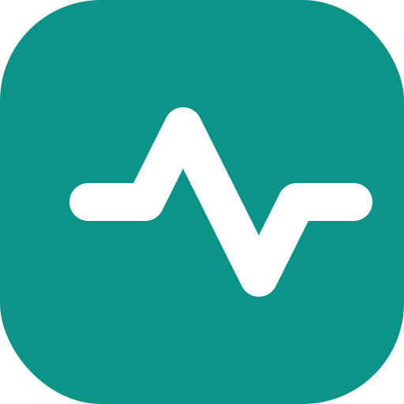
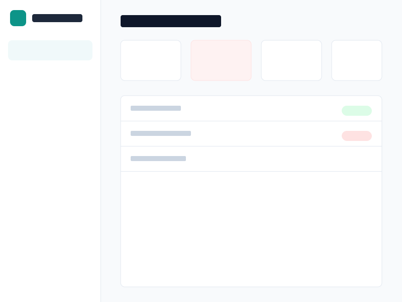

#  AetherHealth FHIR Portal

[](https://opensource.org/licenses/MIT)
[](http://hl7.org/fhir/)
[](https://deepmind.google/technologies/gemini/)

> **A bridge between legacy healthcare data and modern AI-driven clinical insights.**

### [🚀 LAUNCH LIVE APP](https://ai.studio/apps/drive/1KdM4XZO5ESKjnUoZHihNy-Ev0DpooiRU?fullscreenApplet=true)

---

## 📖 The Story: Connecting the Dots in Healthcare

### The Challenge: A Disconnected Reality
Imagine a rural field clinic or a busy triage center. Data comes in fast—often on paper, simplified Google Forms, or legacy spreadsheets. 
Meanwhile, advanced AI tools exist that could predict patient deterioration, but they only speak the complex language of modern standards like **HL7 FHIR**.

There is a massive chasm between **"The data we have"** (CSVs, forms) and **"The data AI needs"** (Structured FHIR JSON).

### The Solution: AetherHealth
AetherHealth was built to bridge this gap. It acts as an intelligent interoperability layer that:
1.  **Listens** to simple data streams (like the Google Sheets linked to Triage Forms).
2.  **Translates** messy inputs into strict, international healthcare standards (HL7 v2 & FHIR R4).
3.  **Augments** the structured data with Google's Gemini AI to provide instant "Second Opinion" clinical summaries.

We didn't just build a dashboard; we built a translation engine that turns raw rows of spreadsheet data into lifesaving clinical context.

---

## 📸 System Overview

### The Operations Dashboard
*A real-time command center showing patient status, triage priority, and facility load.*



---

## ⚡ Key Capabilities

### 1. Smart Ingestion Engine
Real-world data is never perfect. Our "Universal Form Adapter":
- **Fuzzy Matches Headers:** It understands that "What is the patient's temp?" means `Body Temperature`.
- **Prevents Duplicates:** It intelligently merges new form responses into existing patient records using ID matching logic.
- **Simulates Legacy Tech:** It generates raw **HL7 v2.5 ADT messages** internally to demonstrate how legacy hospital systems communicate.

### 2. AI-Powered Clinical Intelligence
We leverage **Google Gemini 2.5 Flash** to act as an always-on clinical assistant.
- **Contextual Summary:** Instead of forcing a doctor to read 20 rows of vitals, the AI writes: *"Patient exhibiting tachycardia (110 bpm) and elevated temp, suggesting possible infection."*
- **Risk Assessment:** It scans the FHIR bundle to assign a Triage Priority (P1-Critical to P4-Non-urgent).

### 3. Hybrid Data Mode
- **Local Sandbox:** Run entirely offline with browser-based storage for privacy and demos.
- **Public Interoperability:** Toggle a switch to connect to the **HAPI FHIR Public Server**, allowing the app to search and visualize real-world test data from the global FHIR community.

---

## 🛠️ How It Works (The Pipeline)

1.  **Data Entry:** A nurse submits a Google Form.
2.  **Sync:** The AetherHealth portal pulls the published CSV.
3.  **Normalization:** 
    *   Row ➜ HL7 Message (ADT^A01)
    *   HL7 ➜ FHIR Resources (Patient, Encounter, Observation)
4.  **AI Analysis:** The FHIR Bundle is sent to Gemini to generate the "Clinical Summary" and "Triage Tag".
5.  **Visualization:** The dashboard updates in real-time.

---

## 🚀 How to Run Locally

1. **Clone the repository**
2. **Install Dependencies:**
   ```bash
   npm install
   ```
3. **Configure API Key:**
   Create a `.env` file and add your Google Gemini API Key:
   ```env
   API_KEY=your_google_ai_studio_key
   ```
4. **Start the App:**
   ```bash
   npm start
   ```

---

## 🔮 Future Roadmap
- [ ] **Wearable Integration:** Direct API hooks for Apple Watch / Fitbit data.
- [ ] **Voice-to-FHIR:** Using Gemini Live API to transcribe doctor notes directly into ClinicalImpressions.
- [ ] **Backend Persistence:** Moving from LocalStorage to a real FHIR Server (Firely or Google Cloud Healthcare API).

---

*Built with ❤️ for the future of Digital Health.*
